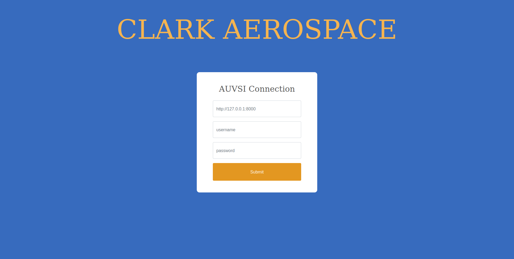

# AUVSI System
Ground control application that will be used to compete in the AUVSI autonomous drone competition.


<div align="center">


</div>


## Table of contents
* [Prerequisites](#prerequisites)
* [Getting Started](#getting-started)
    + [First time set-up](#first-time-set-up)
    + [Running the Interop Server](#running-the-interop-server)
    + [Running the Interop Client](#running-the-interop-client)

* [Simulation Setup](#Simulation-Setup)    
    + [PX4 Installation](#px4-installation)
    + [QGroundControl Installation](#qgroundcontrol-installation)
    + [Gazebo Installation](#gazebo-installation)
    + [Running the SITL Simulation ](#running-the-sitl-simulation)    


* [Features](#features)
* [Documentation](#documentation)


### Prerequisites
* [Ubuntu](http://www.ubuntu.com/download/desktop/install-ubuntu-desktop)
* [Ubuntu Terminal](https://help.ubuntu.com/community/UsingTheTerminal)
* [Linux Shell](http://linuxcommand.org/learning_the_shell.php)
* [Git](https://git-scm.com/doc)
* [Github](https://guides.github.com/activities/hello-world)
* [Docker](https://docs.docker.com/engine/getstarted)
* [Python](https://docs.python.org/2/tutorial)
* [Virtualenv](https://virtualenv.pypa.io/en/stable)
* [Pip](https://pip.pypa.io/en/stable/user_guide)
* [Django](https://docs.djangoproject.com/en/1.8/intro)
* [Protobuf](https://developers.google.com/protocol-buffers/docs/pythontutorial)
* [Postgres](https://www.postgresql.org/docs/9.3/static/index.html)
* [Nginx](https://www.nginx.com)

## Getting Started

### First time set up
1) Clone the Git repository
```sh
git clone https://github.com/clark-aerospace/AUVSI.git --recursive
```

2) cd interop/server
```sh
cd AUVSI/interop/server
```

3) Create the interop server's database.

```sh
sudo ./interop-server.sh create_db
```

4) Load initial test data into the server. This provides access to a default admin
account (u: `testadmin`, p: `testpass`) and a default team account (u:
`testuser`, p: `testpass`). This will also load a sample mission into the server.

```sh
sudo ./interop-server.sh load_test_data
```

### Running the Interop Server
#### Start shell
1) Change into the client subdirectory of the Git repo.
```sh
cd AUVSI/interop/server
```
2) Run the interop server on port 8000. The server will run until stopped using `Ctrl-C`.
```sh
sudo ./interop-server.sh up
```

### Running the Interop Client
#### Start shell
1) Change into the client subdirectory of the Git repo.
```sh
cd AUVSI/interop/client
```
2) Run the Docker container.
```sh
sudo docker run --net=host --interactive -v $(cd ../.. && pwd)/auvsi_system:/interop/auvsi_system --tty auvsisuas/interop-client

```
3) Change into the auvsi_system subdirectory of the Git repo.
```sh
cd /interop/auvsi_system
```
4) Install system requirements
```sh
sudo bash install.sh
```

3) Run the AUVSI interface system on port 5000. The app will run until stopped using `Ctrl-C`. 
```sh
python manage.py runserver 0.0.0.0:5000
```

## Simulation Setup

### PX4 Installation
PX4 is an open source flight control software for drones and other unmanned vehicles. The project provides a flexible set of tools for drone developers to share technologies to create tailored solutions for drone applications. PX4 provides a standard to deliver drone hardware support and software stack, allowing an ecosystem to build and maintain hardware and software in a scalable way.

1) Follow installation steps located in the following link 
```sh
https://docs.px4.io/master/en/dev_setup/dev_env.html
```

### QGroundControl Installation
QGroundControl provides full flight control and mission planning for any MAVLink enabled drone. 

1) Follow installation steps located in the following link 
```sh
https://docs.qgroundcontrol.com/master/en/getting_started/download_and_install.html
```

### Installation
1) Follow installation steps located in the following link 
```sh
https://docs.qgroundcontrol.com/master/en/getting_started/download_and_install.html
```
### Gazebo Installation
1) Follow installation steps located in the following link 
```sh
https://docs.px4.io/master/en/simulation/gazebo.html
```

### Running the SITL Simulation
1) Start QGroundControl by double clicking the appliation

2) cd to the PX4 Firmware directory.
```sh
cd path/to/PX4-Autopilot
```

3) Configure enviroment variables 
```sh
export PX4_HOME_LAT=38.1446916666667
export PX4_HOME_LON=-76.4279944444445
export PX4_HOME_ALT=28.0
```

3) Run PX4 SITL simualtion using Gazebo (resources:https://docs.px4.io/master/en/simulation/gazebo_vehicles.html)
```sh
make px4_sitl gazebo_standard_vtol
```

4) Change into the client subdirectory of the Git repo.
```sh
cd AUVSI/interop/client
```
5) Run the Docker container.
```sh
sudo docker run --net=host --interactive -v $(cd ../.. && pwd)/auvsi_system:/interop/auvsi_system --tty auvsisuas/interop-client

```
6) Change into the auvsi_system subdirectory of the Git repo.
```sh
cd /interop/auvsi_system
```
7) Install system requirements
```sh
sudo bash install.sh
```
```
6) Change into the auvsi_system/communication subdirectory of the Git repo.
```sh
cd /interop/auvsi_system/communication
```
8) Run MAVSDK-Python program to upload missions to the drone
```sh
python takeoff_and_land.py
```
or 
```sh
python mission.py 
```

## Features

## Documentation


